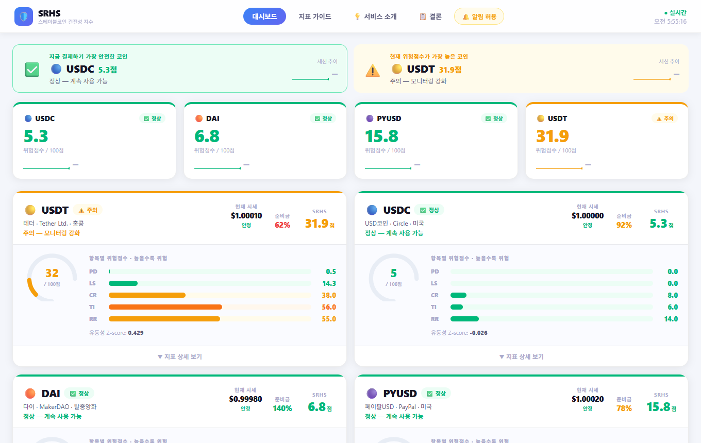
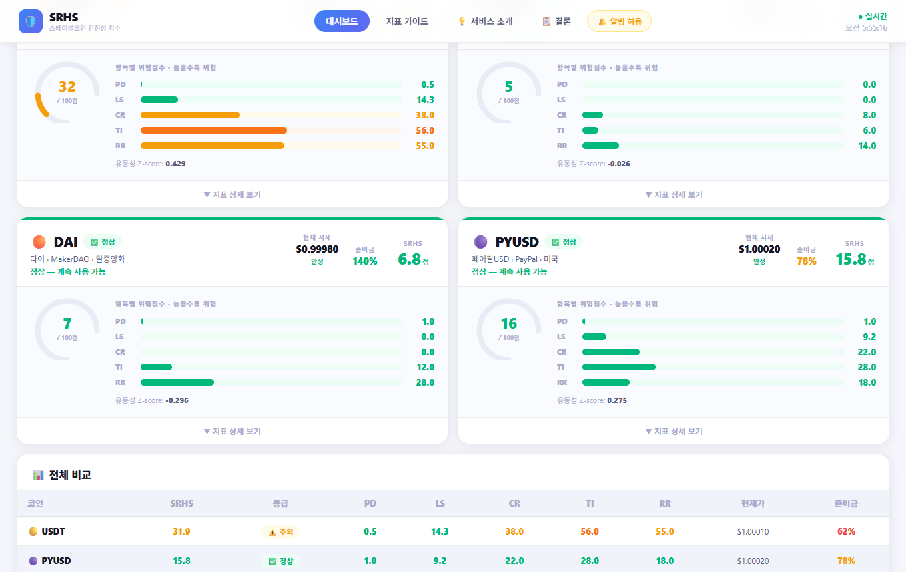
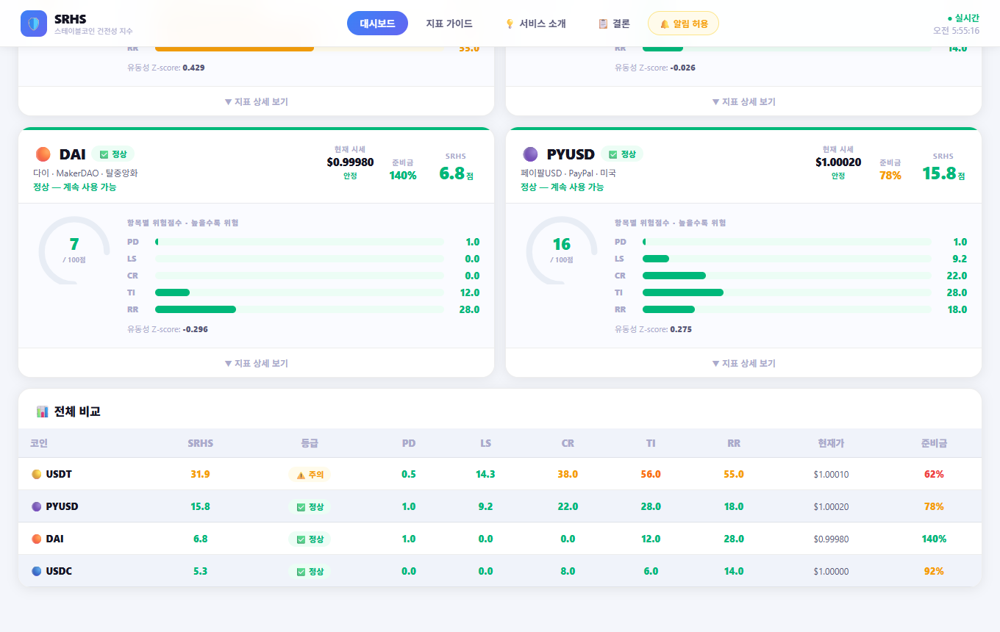
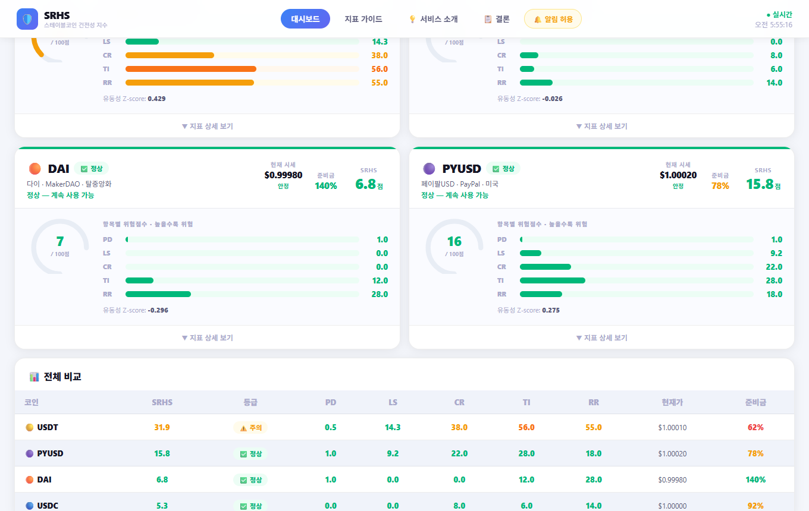
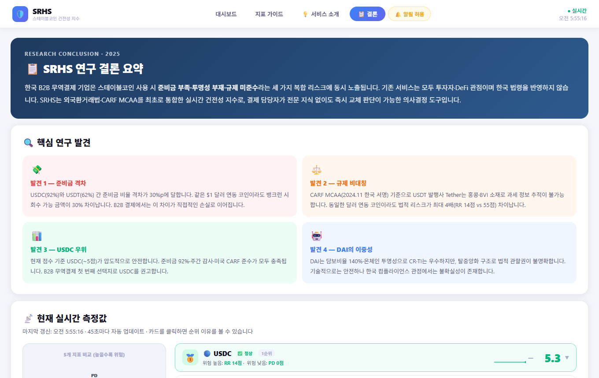

# 🛡️ SRHS — 스테이블코인 위험 건전성 지수 대시보드

**Stablecoin Risk Health Score** | B2B 무역결제 환경에 특화된 실시간 스테이블코인 위험 지수 모니터링 시스템

> 오성준 (AI학과) — SRHS 팀 프로젝트 개인 구현 파트 (PD · LS 지표 담당)

---

## 개요

USDT · USDC · DAI · PYUSD 4종 스테이블코인의 위험도를 5개 지표로 정량화하여  
실시간(45초 자동갱신)으로 점수화하는 단일 페이지 웹앱입니다.

```
SRHS = PD×20% + LS×20% + CR×25% + TI×20% + RR×15%
       (0 ~ 100, 높을수록 위험)
```

| 등급 | 범위 | 의미 |
|------|------|------|
| 🟢 LOW | 0 ~ 30 | 정상 — 계속 사용 가능 |
| 🟡 CAUTION | 31 ~ 55 | 주의 — 모니터링 강화 |
| 🟠 HIGH | 56 ~ 75 | 위험 — 교체 검토 |
| 🔴 CRITICAL | 76 ~ 100 | 즉시 교체 권고 |

---

## 스크린샷

### 1. 개요 탭 — 코인별 요약 카드

각 코인의 SRHS 점수, 등급 배지, 현재가, 원형 게이지, 지표별 바 차트를 한눈에 확인합니다.  
상단 2개(USDC · USDT)는 1순위/2순위 추천으로 강조 표시됩니다.



---

### 2. 개요 탭 — 원형 게이지 & 지표 상세

각 코인 카드의 원형 게이지와 PD / LS / CR / TI / RR 5개 지표 점수 바를 보여줍니다.  
⚡ 아이콘은 실시간 산출 지표, 📌는 정책 고정값 지표입니다.



---

### 3. 개요 탭 — 스파크라인 & 전체 비교 테이블

코인별 SRHS 점수 시계열 스파크라인(45초 단위 최대 30개 이력)과  
하단의 전체 비교 테이블(숫자 + 미니 바 차트)을 확인할 수 있습니다.



---

### 4. 비교분석 탭 — 지표 비교 테이블

4개 코인의 5개 지표 점수를 격자 형태로 비교합니다.  
각 셀에는 점수 숫자와 함께 36px 미니 바 차트가 표시되어 상대적 위험도를 시각적으로 파악할 수 있습니다.


---

### 5. 비교분석 탭 — 레이더 차트

오각형 SVG 레이더 차트로 PD · LS · CR · TI · RR 5개 축을 동시 비교합니다.  
코인마다 색상이 구분되어 겹쳐 표시되므로 강점/약점 패턴을 직관적으로 파악할 수 있습니다.

- 🔵 USDC — 파란색
- 🟠 DAI — 주황색
- 🟣 PYUSD — 보라색
- 🟡 USDT — 노란색



---

### 6. 결론 탭 — 순위 카드

SRHS 점수 기준 4개 코인의 추천 순위를 🥇🥈🥉🔸 뱃지로 표시합니다.  
1순위(녹색 강조) → 가장 안전, 4순위(적색 강조) → 가장 위험.  
카드를 클릭하면 해당 순위인 이유(지표 상세 + 설명)가 펼쳐집니다.


---

### 7. 결론 탭 — 순위 이유 상세 펼침

순위 카드 클릭 시 5개 지표 점수 바와 함께 위험 판단 근거 텍스트가 표시됩니다.



---

## 5개 지표 설명

| 지표 | 가중치 | 산출 방법 | 데이터 소스 |
|------|--------|-----------|-------------|
| **PD** 가격이탈 | 20% | `min(|price − 1| / 0.02 × 100, 100)` | CoinGecko ⚡ |
| **LS** 유동성충격 | 20% | 30일 거래량 Z-score → 0~100 정규화 | CoinGecko ⚡ |
| **CR** 준비금비율 | 25% | `max(0, 100 − min(준비율×100, 200))` | 공식공시 📌 / DeFiLlama(DAI) ⚡ |
| **TI** 투명성지수 | 20% | 공시 주기·감사 여부 기반 정책 점수 | 정책값 📌 |
| **RR** 규제위험 | 15% | 외국환거래법·CARF MCAA 준수 여부 | 정책값 📌 |

### 한국 규제 맥락

- **외국환거래법 제18조** : 무신고 외환거래 제재 기준
- **CARF MCAA** : 한국 2024.11.27 서명, 48개국 가입 — 암호화폐 자동 과세정보 교환
- USDT(Tether, BVI 법인, CARF 미가입) → 추적 불가, 규제 위험 최고
- USDC(Circle, 미국, CARF + FATCA + CRS 완전 준수) → 규제 위험 최저

---

## 기술 스택

| 분류 | 사용 기술 |
|------|-----------|
| 프레임워크 | React 18 + Vite |
| 차트 | 순수 SVG (레이더, 스파크라인, 원형 게이지) |
| 외부 API | CoinGecko Free API, DeFiLlama API |
| 알림 | Web Push Notifications API |
| 스타일 | CSS 변수 + 인라인 스타일 |

---

## 실행 방법

```bash
npm install
npm run dev
# → http://localhost:3000
```

데이터는 최초 로드 시 CoinGecko API에서 가져오며 **45초마다 자동 갱신**됩니다.  
API Rate-limit(429) 발생 시 8초 대기 후 자동 재시도합니다.

---

## 파일 구조

```
src/
├── App.jsx       # 전체 UI 및 대시보드 로직
├── api.js        # CoinGecko / DeFiLlama API 호출
├── scoring.js    # SRHS 산식 및 등급 판정
└── index.css     # CSS 변수 및 글로벌 스타일
```
