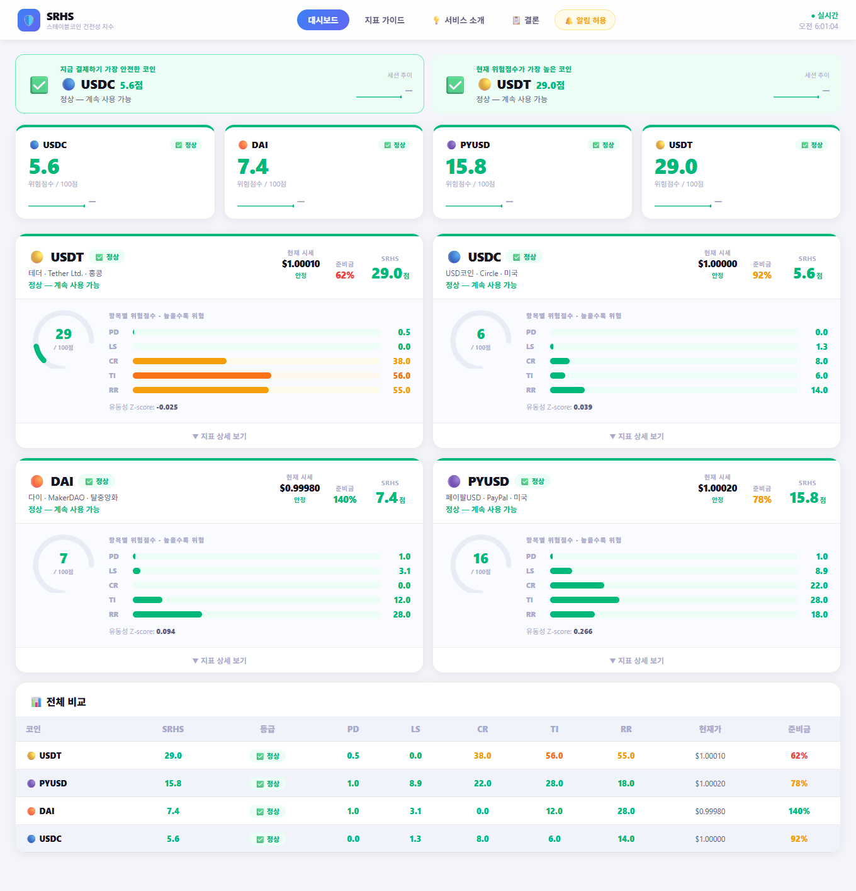
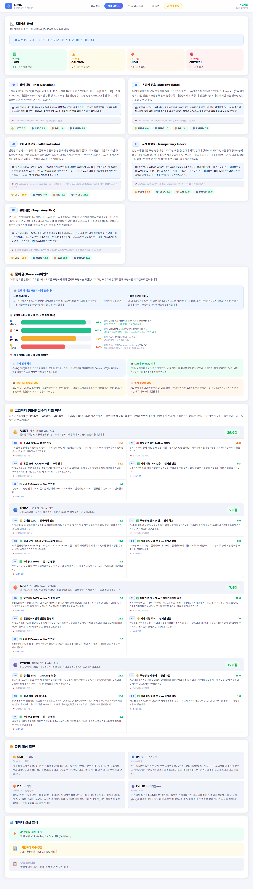
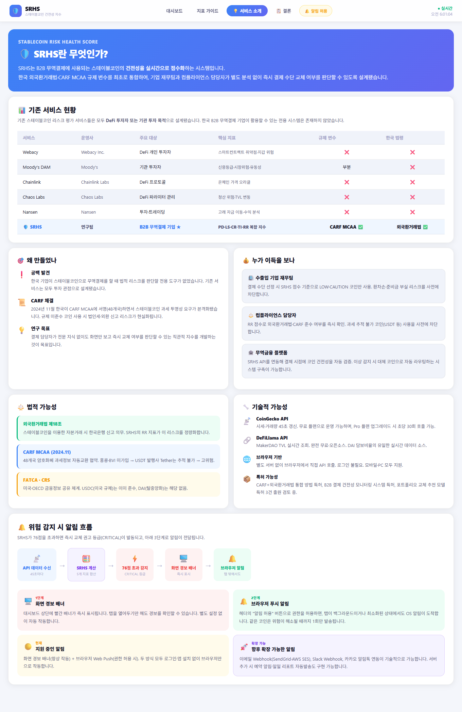
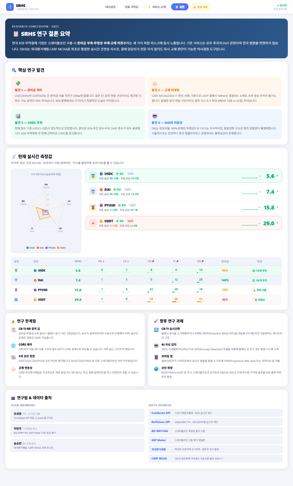

# 🛡️ SRHS — 스테이블코인 위험 건전성 지수 대시보드

**Stablecoin Risk Health Score** | B2B 무역결제 환경에 특화된 실시간 스테이블코인 위험 지수 모니터링 시스템

> 오성준 (AI학과) — SRHS 팀 프로젝트 개인 구현 파트 (PD · LS 지표 담당)

---

## 개요

USDT · USDC · DAI · PYUSD 4종 스테이블코인의 위험도를 5개 지표로 정량화하여  
실시간(45초 자동갱신)으로 점수화하는 단일 페이지 웹앱입니다.

```
SRHS = PD×20% + LS×20% + CR×25% + TI×20% + RR×15%
       (0 ~ 100, 높을수록 위험)
```

| 등급 | 범위 | 의미 |
|------|------|------|
| 🟢 LOW | 0 ~ 30 | 정상 — 계속 사용 가능 |
| 🟡 CAUTION | 31 ~ 55 | 주의 — 모니터링 강화 |
| 🟠 HIGH | 56 ~ 75 | 위험 — 교체 검토 |
| 🔴 CRITICAL | 76 ~ 100 | 즉시 교체 권고 |

---

## 스크린샷

### 탭 1 — 대시보드

코인별 SRHS 점수·등급 배지·현재가·원형 게이지·지표 바 차트를 실시간으로 보여줍니다.  
상단에 1순위(USDC)·2순위(USDT) 추천 카드가 강조 표시되고, 하단에는 4개 코인 전체 지표 비교 테이블과 스파크라인(45초 단위 이력)이 제공됩니다.



---

### 탭 2 — 지표 가이드

SRHS를 구성하는 5개 지표(PD · LS · CR · TI · RR)의 산출 공식, 해석 방법, 각 코인별 현재 수치를 상세하게 설명합니다.  
현재 SRHS 점수 순위와 함께 각 지표가 어떤 의미를 갖는지 학술·정책 근거를 포함하여 안내합니다.



---

### 탭 3 — 서비스 소개

SRHS가 무엇인지, 왜 만들었는지, 누가 이용하면 좋은지 소개합니다.  
기존 서비스 현황 비교표, 핵심 기능 목록(법적·기술적), 위험 감지 시 알림 흐름도, 기술 스택(CoinGecko API · DeFiLlama · CARF MCAA)까지 포함됩니다.



---

### 탭 4 — 결론

연구 결론 요약과 함께 4개 코인의 최종 순위를 레이더 차트·점수표·지표 비교 테이블로 종합 정리합니다.  
순위 카드(🥇🥈🥉🔸)를 클릭하면 해당 코인이 그 순위인 이유(지표별 강약점)가 상세하게 펼쳐집니다.  
하단에는 연구 한계·향후 과제·참고 데이터 출처도 기재되어 있습니다.



---

## 5개 지표 설명

| 지표 | 가중치 | 산출 방법 | 데이터 소스 |
|------|--------|-----------|-------------|
| **PD** 가격이탈 | 20% | `min(|price − 1| / 0.02 × 100, 100)` | CoinGecko ⚡ |
| **LS** 유동성충격 | 20% | 30일 거래량 Z-score → 0~100 정규화 | CoinGecko ⚡ |
| **CR** 준비금비율 | 25% | `max(0, 100 − min(준비율×100, 200))` | 공식공시 📌 / DeFiLlama(DAI) ⚡ |
| **TI** 투명성지수 | 20% | 공시 주기·감사 여부 기반 정책 점수 | 정책값 📌 |
| **RR** 규제위험 | 15% | 외국환거래법·CARF MCAA 준수 여부 | 정책값 📌 |

### 한국 규제 맥락

- **외국환거래법 제18조** : 무신고 외환거래 제재 기준
- **CARF MCAA** : 한국 2024.11.27 서명, 48개국 가입 — 암호화폐 자동 과세정보 교환
- USDT(Tether, BVI 법인, CARF 미가입) → 추적 불가, 규제 위험 최고
- USDC(Circle, 미국, CARF + FATCA + CRS 완전 준수) → 규제 위험 최저

---

## 기술 스택

| 분류 | 사용 기술 |
|------|-----------|
| 프레임워크 | React 18 + Vite |
| 차트 | 순수 SVG (레이더, 스파크라인, 원형 게이지) |
| 외부 API | CoinGecko Free API, DeFiLlama API |
| 알림 | Web Push Notifications API |
| 스타일 | CSS 변수 + 인라인 스타일 |

---

## 실행 방법

```bash
npm install
npm run dev
# → http://localhost:3000
```

데이터는 최초 로드 시 CoinGecko API에서 가져오며 **45초마다 자동 갱신**됩니다.  
API Rate-limit(429) 발생 시 8초 대기 후 자동 재시도합니다.

---

## 파일 구조

```
src/
├── App.jsx       # 전체 UI 및 대시보드 로직 (5개 탭)
├── api.js        # CoinGecko / DeFiLlama API 호출
├── scoring.js    # SRHS 산식 및 등급 판정
├── payment.js    # 결제·구독 로직 (Stripe 카드 / USDC·USDT 온체인)
├── Pricing.jsx   # 요금제 탭 · 결제 모달 · 프리미엄 잠금 UI
└── index.css     # CSS 변수 및 글로벌 스타일
```

---

## 💳 결제 시스템

`💳 요금제` 탭에서 **Free / Pro / Enterprise** 플랜을 제공하며, 백엔드 없는
정적 호스팅(GitHub Pages)에서 동작하도록 두 가지 결제 경로를 지원합니다.

| 결제 수단 | 동작 방식 |
|-----------|-----------|
| **카드** | Stripe Payment Link 로 이동 → 결제 후 `?checkout=success` 로 복귀 시 구독 활성화 |
| **크립토** | 지갑(MetaMask 등)에서 USDC/USDT(ERC-20)를 가맹점 주소로 직접 전송, 트랜잭션 영수증 확인 후 구독 활성화 |

구독 상태는 `localStorage`(30일 유효)에 저장되며, Pro 전용 기능(코인 비교 분석 등)은
구독 시 잠금이 해제됩니다.

### 실제 결제를 받으려면 (config 교체)

`src/payment.js` 상단의 값을 본인 것으로 교체하세요.

```js
// 1) 카드 — Stripe 대시보드 > Payment Links 에서 생성한 링크
export const STRIPE_LINKS = { pro: 'https://buy.stripe.com/...' };
//    링크의 결제 후 이동(success) URL 을 아래로 설정:
//    https://sojo1211.github.io/SRHS-STABLECOIN-RISK-HEALTH-SCORE-/?checkout=success&plan=pro

// 2) 크립토 — 결제를 수취할 가맹점 지갑 주소
export const CRYPTO = { merchant: '0xYOUR_WALLET_ADDRESS', ... };
```

> ⚠️ **보안 안내** — 정적 사이트에는 서버가 없으므로 구독 권한이 브라우저
> `localStorage` 에만 저장됩니다(데모/MVP 수준). 위·변조가 불가능한 정식
> 권한 부여가 필요하면, Stripe **Webhook**(`checkout.session.completed`)과
> 크립토 **온체인 결제 검증**을 처리하는 서버리스 함수(Vercel/Netlify/Cloudflare
> Workers)를 추가하고, 그 결과로 발급한 토큰(JWT 등)으로 기능을 게이팅하세요.
